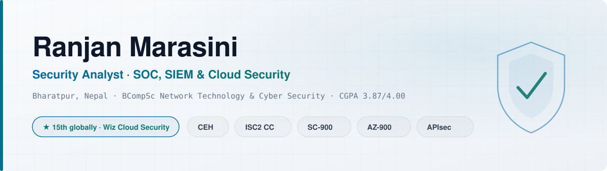
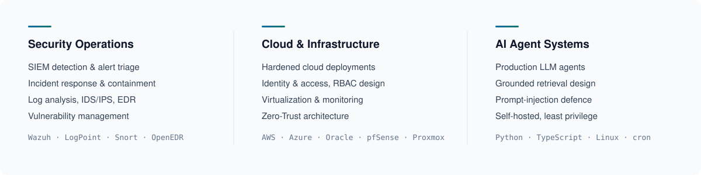

<picture>
  <source media="(prefers-color-scheme: dark)" srcset="assets/banner-dark.svg">
  <source media="(prefers-color-scheme: light)" srcset="assets/banner-light.svg">
  
</picture>

I work on keeping systems defensible: monitoring them, hardening them, and proving they meet the standards they claim to. Currently a security analyst and cybersecurity lecturer in Nepal, looking for SOC, cloud security and GRC work.

<picture>
  <source media="(prefers-color-scheme: dark)" srcset="assets/focus-dark.svg">
  <source media="(prefers-color-scheme: light)" srcset="assets/focus-light.svg">
  
</picture>

## Selected work

**[school-assistant-agent-architecture](https://github.com/Rockerran21/school-assistant-agent-architecture)** — Architecture case study
A production LLM agent for an early-education provider, running on a VPS I administer. It answers curriculum questions strictly from the school's own syllabus files rather than model memory, ingests new material sent in chat, and checks lesson plans against current government regulations. Covers the grounded-retrieval design, explicit load-state markers, and why ingested content is treated as data rather than instruction.

**[ambient-agent-architecture](https://github.com/Rockerran21/ambient-agent-architecture)** — Architecture case study
An agent that lives in a team's group chat instead of waiting to be prompted: it extracts commitments from ordinary conversation, tracks them in graph-structured memory, and follows up when deadlines slip. Covers conservative extraction, scheduled autonomy, prompt injection in a channel anyone can write to, and the calibration problem of when an ambient agent should speak at all.

**[Practical-CTF-Strategies](https://github.com/Rockerran21/Practical-CTF-Strategies)** — Teaching material
The hands-on challenges behind the CTF Strategies course I designed and teach to 5th-semester students: forensics, web, network analysis, reverse engineering, cryptography and OSINT.

**[Hospital-Reporting-System](https://github.com/Rockerran21/Hospital-Reporting-System)** — Infrastructure work
An RBAC patient-data tracking system with department-wise logging, built on an Nginx microservices architecture during my system administration internship at a cancer hospital.

## Security writing

I publish offensive cloud and CI/CD research at **[ranjanm-security.medium.com](https://ranjanm-security.medium.com/)**:

- **Sniping the Cloud** — my Wiz championship writeup: exploiting a loose regex in AWS CodeBuild webhook filters by sniping a sequential bot user ID, then poisoned pipeline execution into secret exfiltration
- **Beating the Clock** — Terraform TOCTOU race conditions: a sticky-bit ownership race with a gRPC side channel and staggered timing attack on provider loading
- Blue-team pieces on proactive security monitoring and detection engineering

## Background

**Associate Security Research Analyst**, SecurityPal — enterprise security assurance across ISO 27001, SOC 2, FedRAMP and ISO 42001 at a 99.999% SLA, plus SOC weekly reporting on LogPoint SIEM
**Instructor, Cybersecurity**, Forbes College — designed and teach the CTF Strategies course
**System Administrator Intern**, B.P. Koirala Memorial Cancer Hospital — Proxmox virtualization, Zabbix monitoring, RBAC systems
**BCompSc, Network Technology & Cyber Security** — CGPA 3.87/4.00. Capstone: a Zero-Trust architecture integrating Wazuh, Snort on pfSense and OpenEDR, aligned to NIST SP 800-207

**Certifications** CEH · (ISC)² Certified in Cybersecurity · Microsoft SC-900 · Microsoft AZ-900 · APIsec Certified Practitioner

---

[Portfolio](https://rockerran21.github.io/) · [LinkedIn](https://www.linkedin.com/in/ranjan-marasini-434202182/) · [Medium](https://ranjanm-security.medium.com/) · 
